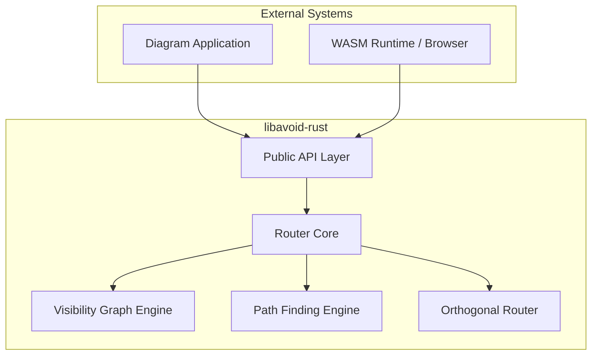
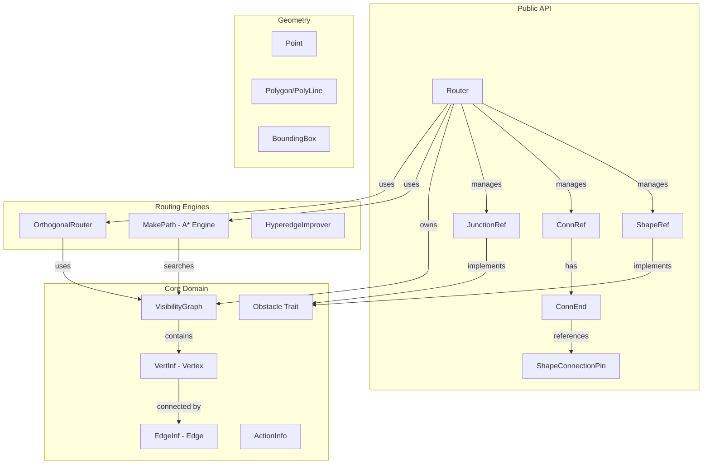
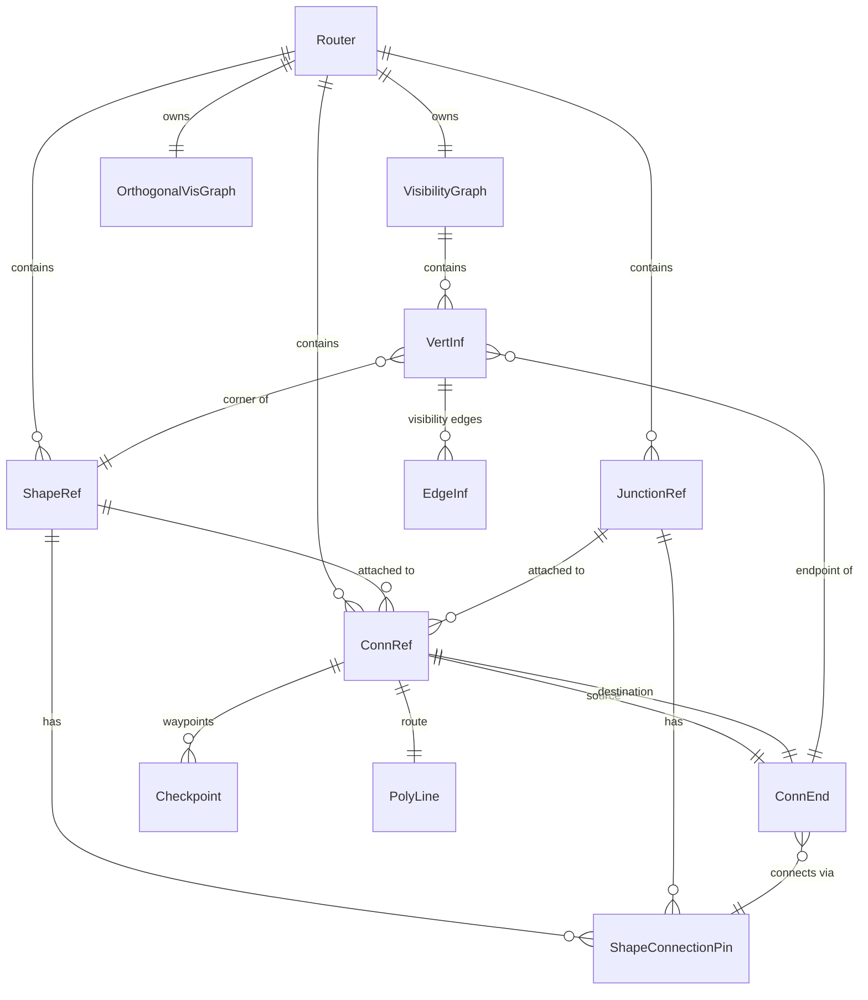
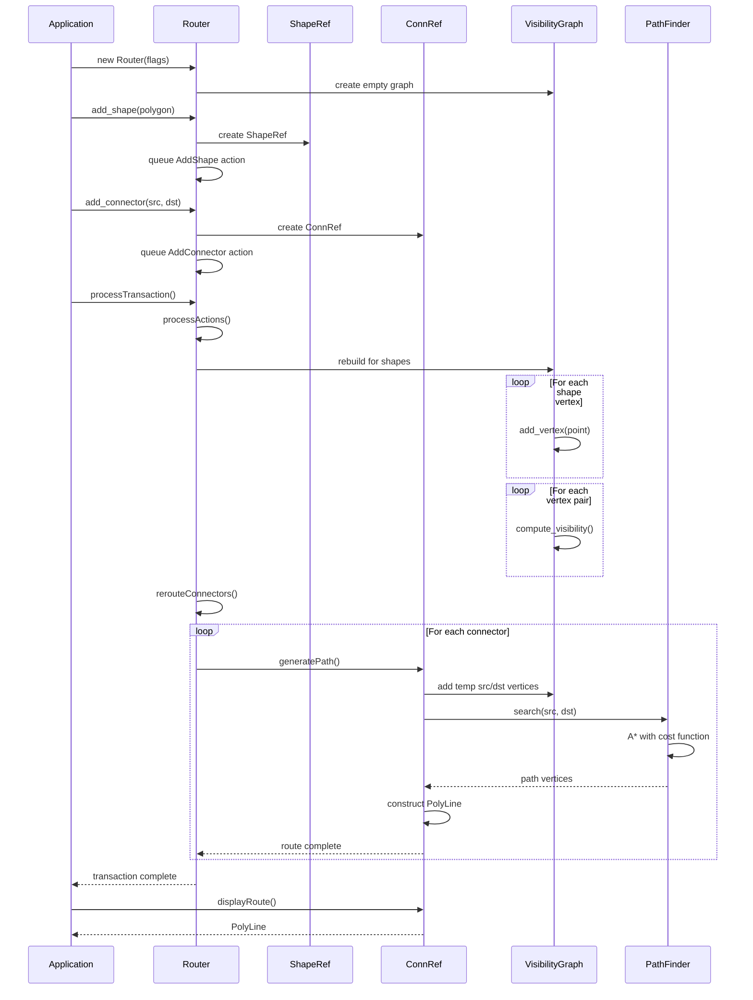
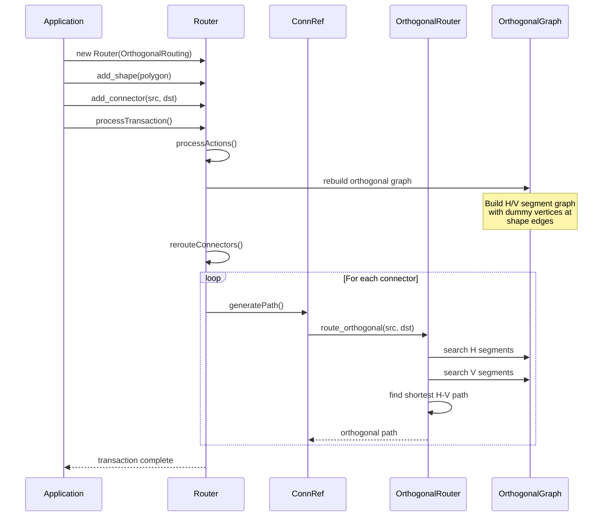
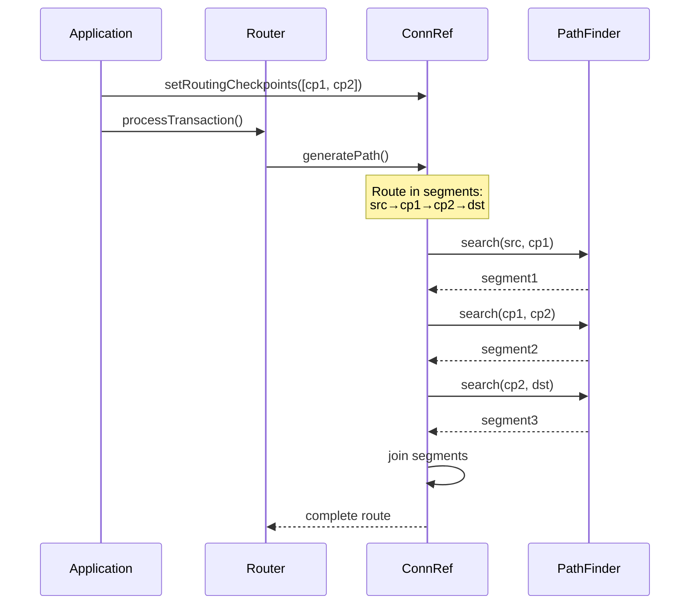
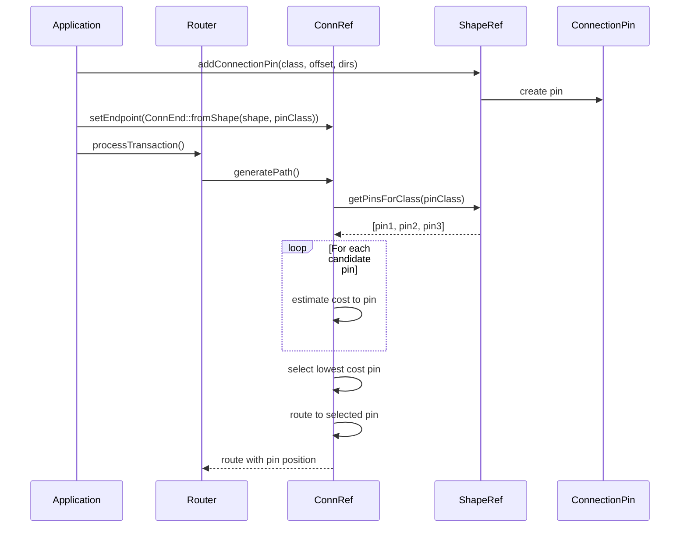
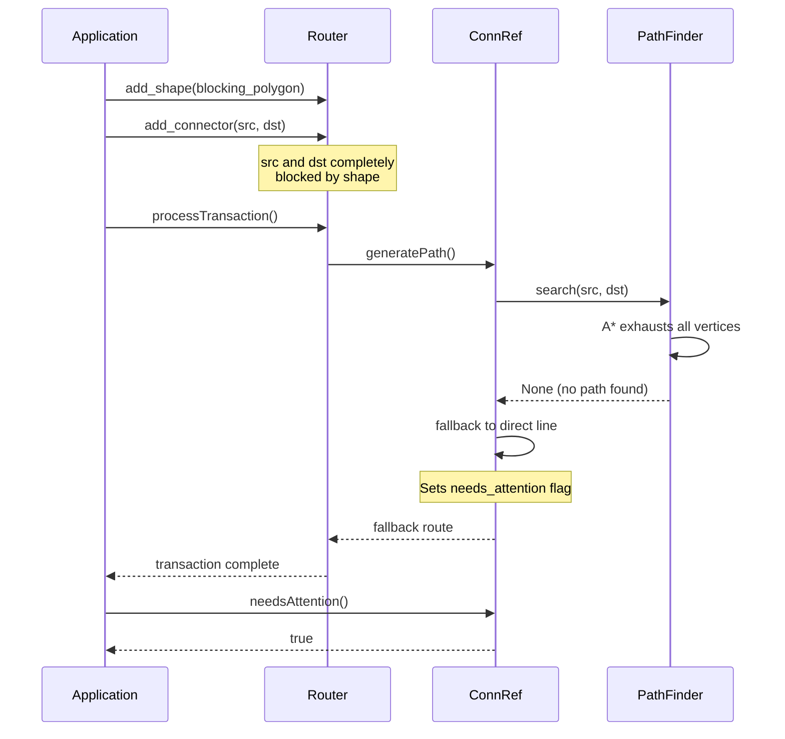
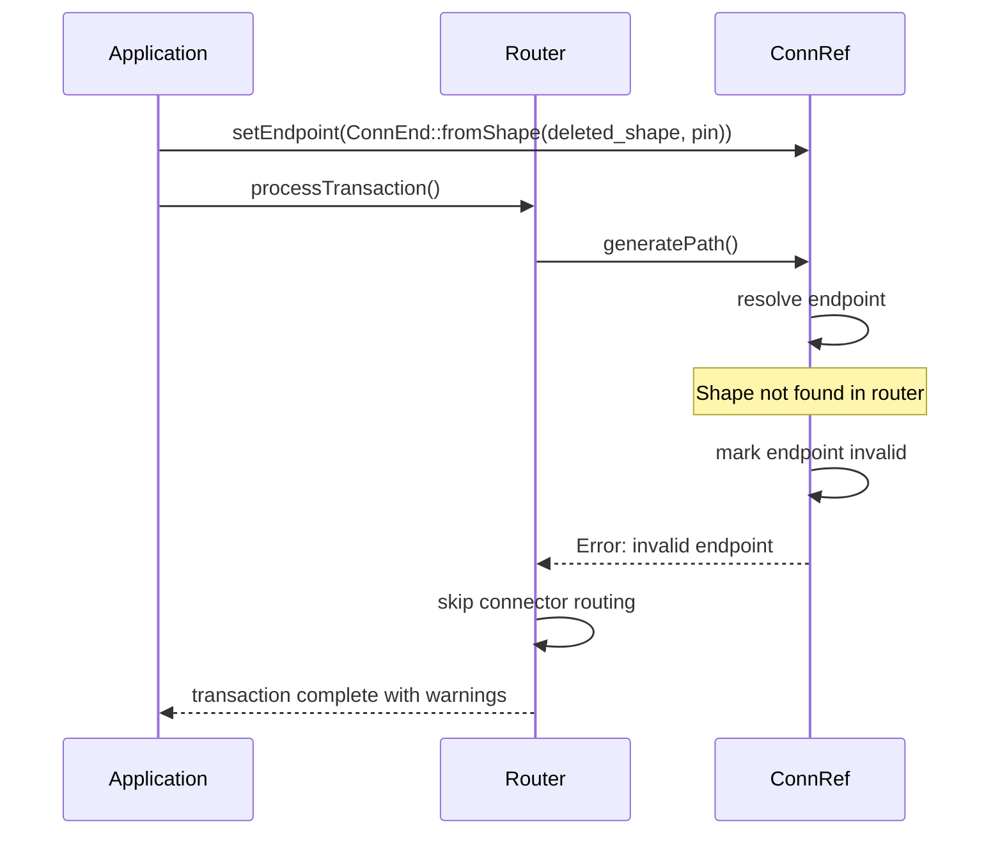

# libavoid-rust Technical Design Document

## Version History

| Version | Date | Author | Description |
|---------|------|--------|-------------|
| 1.0 | 2024-11-23 | Claude | Initial baseline design mirroring C++ libavoid |

---

## 1. Executive Summary

This document specifies the technical design for a complete Rust implementation of libavoid, an automatic connector routing library for interactive diagram editors. The design mirrors the proven C++ implementation from the Adaptagrams project while leveraging Rust's type system and memory safety guarantees.

### 1.1 Goals

- **Functional Parity**: Match C++ libavoid's routing behavior exactly
- **API Compatibility**: Maintain compatible WASM bindings for libavoid-js migration
- **Performance**: Achieve comparable or better performance than C++ version
- **Maintainability**: Clean Rust idioms with comprehensive testing

### 1.2 Non-Goals

- GUI/rendering (handled by consumers)
- Persistence/serialization (out of scope for core library)
- Automatic layout (separate library concern)

---

## 2. Architecture Overview

### 2.1 System Context



### 2.2 Component Architecture



### 2.3 Entity Relationships



### 2.4 Cardinality Summary

| Relationship | Cardinality | Description |
|--------------|-------------|-------------|
| Router → ShapeRef | 1:N | Router manages 0..* shapes |
| Router → ConnRef | 1:N | Router manages 0..* connectors |
| Router → JunctionRef | 1:N | Router manages 0..* junctions |
| ShapeRef → Pin | 1:N | Shape has 0..* connection pins |
| ConnRef → ConnEnd | 1:2 | Connector has exactly 2 endpoints |
| ConnRef → Checkpoint | 1:N | Connector has 0..* checkpoints |
| VisGraph → VertInf | 1:N | Graph contains 0..* vertices |
| VertInf → EdgeInf | 1:N | Vertex has 0..* visibility edges |

---

## 3. Sequence Diagrams

### 3.1 Golden Path: Basic Connector Routing



### 3.2 Alternate Path: Orthogonal Routing



### 3.3 Alternate Path: Connector with Checkpoints



### 3.4 Alternate Path: Connection Pin Selection



### 3.5 Error Path: No Valid Route



### 3.6 Error Path: Invalid Endpoint



---

## 4. Detailed Type Design

### 4.1 Core Geometry Types

```rust
/// 2D point with double precision
#[derive(Clone, Copy, Debug, PartialEq)]
pub struct Point {
    pub x: f64,
    pub y: f64,
}

/// Axis-aligned bounding box
#[derive(Clone, Copy, Debug)]
pub struct BoundingBox {
    pub min: Point,
    pub max: Point,
}

/// Polygon or polyline (sequence of points)
#[derive(Clone, Debug)]
pub struct Polygon {
    /// Vertex points
    ps: Vec<Point>,
    /// Vertex types (for routing hints)
    ts: Vec<VertexType>,
}

/// Vertex type classification
#[derive(Clone, Copy, Debug, PartialEq)]
pub enum VertexType {
    Normal,
    /// Shape corner vertex
    ShapeCorner,
    /// Connection endpoint
    ConnectionEnd,
    /// Checkpoint waypoint
    Checkpoint,
    /// Dummy vertex for orthogonal routing
    OrthogonalDummy,
}
```

### 4.2 Router Configuration

```rust
/// Router creation flags
pub type RouterFlags = u32;

pub const ROUTER_FLAG_NONE: RouterFlags = 0;
pub const ROUTER_FLAG_POLYLINE: RouterFlags = 1;
pub const ROUTER_FLAG_ORTHOGONAL: RouterFlags = 2;
pub const ROUTER_FLAG_USE_TRANSACTIONS: RouterFlags = 4;

/// Routing cost parameters
#[derive(Clone, Copy, Debug, PartialEq, Eq, Hash)]
pub enum RoutingParameter {
    /// Cost per path segment (encourages fewer bends)
    SegmentPenalty,
    /// Cost for non-straight angles
    AnglePenalty,
    /// Cost for crossing another connector
    CrossingPenalty,
    /// Cost for crossing cluster boundary
    ClusterCrossingPenalty,
    /// Cost for shared path with fixed route
    FixedSharedPathPenalty,
    /// Cost for violating port direction
    PortDirectionPenalty,
    /// Buffer distance around shapes
    ShapeBufferDistance,
    /// Ideal nudging distance for parallel routes
    IdealNudgingDistance,
    /// Cost for routing away from destination
    ReverseDirectionPenalty,
}

/// Routing behavior options
#[derive(Clone, Copy, Debug, PartialEq, Eq, Hash)]
pub enum RoutingOption {
    /// Nudge orthogonal segments connected to shapes
    NudgeOrthogonalSegmentsConnectedToShapes,
    /// Improve hyperedge routes by moving junctions
    ImproveHyperedgeRoutesMovingJunctions,
    /// Penalize shared paths at connector ends
    PenalizeOrthogonalSharedPathsAtConnEnds,
    /// Nudge collinear segments
    NudgeOrthogonalCollinearSegments,
    /// Perform unifying nudging preprocessing
    PerformUnifyingNudgingPreprocessingStep,
    /// Improve hyperedges by adding/deleting junctions
    ImproveHyperedgeRoutesMovingAddingAndDeletingJunctions,
    /// Nudge shared paths with common endpoint
    NudgeSharedPathsWithCommonEndPoint,
}
```

### 4.3 Obstacle Types

```rust
/// Common trait for routable obstacles
pub trait Obstacle: Send + Sync {
    /// Unique identifier
    fn id(&self) -> ObstacleId;

    /// Polygon boundary
    fn polygon(&self) -> &Polygon;

    /// Polygon with buffer for routing
    fn routing_polygon(&self) -> Polygon;

    /// Bounding box
    fn bounding_box(&self) -> BoundingBox;

    /// Whether obstacle participates in routing
    fn is_active(&self) -> bool;

    /// Router this obstacle belongs to
    fn router(&self) -> Option<&Router>;

    /// Connection pins on this obstacle
    fn connection_pins(&self) -> &[ShapeConnectionPin];

    /// Attached connector IDs
    fn attached_connectors(&self) -> &HashSet<ConnectorId>;
}

/// Shape obstacle (polygon boundary)
pub struct ShapeRef {
    id: ObstacleId,
    polygon: Polygon,
    router: Weak<RefCell<RouterInner>>,
    active: bool,
    pins: Vec<ShapeConnectionPin>,
    attached_connectors: HashSet<ConnectorId>,
}

/// Junction obstacle (point with optional pins)
pub struct JunctionRef {
    id: ObstacleId,
    position: Point,
    router: Weak<RefCell<RouterInner>>,
    position_fixed: bool,
    recommended_position: Option<Point>,
    pins: Vec<ShapeConnectionPin>,
    attached_connectors: HashSet<ConnectorId>,
}
```

### 4.4 Connector Types

```rust
/// Direction flags for connection pins
pub type ConnDirFlags = u32;

pub const CONN_DIR_NONE: ConnDirFlags = 0;
pub const CONN_DIR_UP: ConnDirFlags = 1;
pub const CONN_DIR_DOWN: ConnDirFlags = 2;
pub const CONN_DIR_LEFT: ConnDirFlags = 4;
pub const CONN_DIR_RIGHT: ConnDirFlags = 8;
pub const CONN_DIR_ALL: ConnDirFlags = 15;

/// Connection endpoint specification
#[derive(Clone, Debug)]
pub struct ConnEnd {
    /// Type of endpoint
    kind: ConnEndKind,
    /// Allowed directions
    directions: ConnDirFlags,
}

#[derive(Clone, Debug)]
pub enum ConnEndKind {
    /// Free point in space
    FreePoint(Point),
    /// Attached to shape via pin class
    ShapePin {
        shape_id: ObstacleId,
        pin_class_id: u32,
    },
    /// Attached to junction
    Junction {
        junction_id: ObstacleId,
    },
}

/// Routing checkpoint (waypoint)
#[derive(Clone, Debug)]
pub struct Checkpoint {
    pub point: Point,
    /// Required arrival direction
    pub arrival_directions: ConnDirFlags,
    /// Required departure direction
    pub departure_directions: ConnDirFlags,
}

/// Connector routing type
#[derive(Clone, Copy, Debug, PartialEq)]
pub enum ConnType {
    PolyLine,
    Orthogonal,
}

/// Connector reference
pub struct ConnRef {
    id: ConnectorId,
    router: Weak<RefCell<RouterInner>>,

    /// Source endpoint
    src: ConnEnd,
    /// Destination endpoint
    dst: ConnEnd,

    /// Routing type
    conn_type: ConnType,

    /// Routing checkpoints
    checkpoints: Vec<Checkpoint>,

    /// Computed route
    route: Option<Polygon>,
    /// Display route (post-processed)
    display_route: Option<Polygon>,

    /// Route is user-fixed
    has_fixed_route: bool,
    /// Connector hates crossings
    hate_crossings: bool,
    /// Route needs attention (fallback used)
    needs_attention: bool,
    /// Needs visual update
    needs_repaint: bool,

    /// Callback for route changes
    callback: Option<Box<dyn Fn(&ConnRef) + Send + Sync>>,
}
```

### 4.5 Connection Pin Types

```rust
/// Connection pin on a shape or junction
#[derive(Clone, Debug)]
pub struct ShapeConnectionPin {
    /// Pin class ID (for grouping)
    class_id: u32,
    /// Pin instance ID
    pin_id: u32,
    /// Position relative to shape center
    position: Point,
    /// Whether position is proportional (0-1) or absolute
    proportional: bool,
    /// Inside offset from shape boundary
    inside_offset: f64,
    /// Allowed connection directions
    directions: ConnDirFlags,
    /// Whether pin is exclusive (one connector only)
    exclusive: bool,
    /// Connection cost multiplier
    connection_cost: f64,
    /// Owning obstacle ID
    obstacle_id: ObstacleId,
}
```

### 4.6 Visibility Graph Types

```rust
/// Vertex ID in visibility graph
pub type VertexId = u32;

/// Edge ID in visibility graph
pub type EdgeId = u32;

/// Vertex in visibility graph
pub struct VertInf {
    pub id: VertexId,
    pub point: Point,

    /// Visibility type
    pub vertex_type: VertexType,

    /// Owning obstacle (if shape corner)
    pub obstacle_id: Option<ObstacleId>,

    /// Shape edge indices (for corner vertices)
    pub shape_edge_before: Option<usize>,
    pub shape_edge_after: Option<usize>,

    /// Connection pin (if endpoint)
    pub connection_pin: Option<u32>,

    /// Outgoing visibility edges
    pub edges: Vec<EdgeInf>,

    /// Orthogonal-only edges
    pub orthogonal_edges: Vec<EdgeInf>,

    /// A* search state
    pub search_state: SearchState,
}

/// Edge in visibility graph
#[derive(Clone, Debug)]
pub struct EdgeInf {
    pub id: EdgeId,
    /// Target vertex
    pub target: VertexId,
    /// Edge distance
    pub distance: f64,
    /// Is orthogonal (H or V)
    pub orthogonal: bool,
    /// Edge direction for orthogonal
    pub direction: Option<Direction>,
    /// Connectors using this edge
    pub using_connectors: HashSet<ConnectorId>,
    /// Edge is blocked by obstacle
    pub blocked: bool,
}

/// A* search state for a vertex
#[derive(Clone, Debug, Default)]
pub struct SearchState {
    /// Cost from source
    pub g_score: f64,
    /// Estimated total cost
    pub f_score: f64,
    /// Previous vertex in path
    pub came_from: Option<VertexId>,
    /// Search generation (for reuse)
    pub generation: u32,
}

/// Complete visibility graph
pub struct VisibilityGraph {
    vertices: HashMap<VertexId, VertInf>,
    next_vertex_id: VertexId,
    search_generation: u32,
}
```

### 4.7 Action/Transaction Types

```rust
/// Transaction action type
#[derive(Clone, Debug)]
pub enum ActionType {
    ShapeAdd,
    ShapeRemove,
    ShapeMove,
    JunctionAdd,
    JunctionRemove,
    JunctionMove,
    ConnectorAdd,
    ConnectorRemove,
    ConnectorChange,
}

/// Queued action for transaction processing
#[derive(Clone, Debug)]
pub struct ActionInfo {
    pub action_type: ActionType,
    pub obstacle_id: Option<ObstacleId>,
    pub connector_id: Option<ConnectorId>,
    pub new_polygon: Option<Polygon>,
    pub new_position: Option<Point>,
    pub first_move: bool,
}
```

### 4.8 Router Core Types

```rust
/// Main router struct
pub struct Router {
    inner: Rc<RefCell<RouterInner>>,
}

/// Router internal state
pub(crate) struct RouterInner {
    /// Configuration
    flags: RouterFlags,
    parameters: HashMap<RoutingParameter, f64>,
    options: HashMap<RoutingOption, bool>,

    /// Managed objects
    shapes: HashMap<ObstacleId, ShapeRef>,
    junctions: HashMap<ObstacleId, JunctionRef>,
    connectors: HashMap<ConnectorId, ConnRef>,

    /// ID generators
    next_obstacle_id: ObstacleId,
    next_connector_id: ConnectorId,

    /// Visibility graphs
    vis_graph: VisibilityGraph,
    vis_orth_graph: VisibilityGraph,

    /// Transaction queue
    transaction_mode: bool,
    pending_actions: Vec<ActionInfo>,

    /// Connectors needing reroute
    reroute_queue: HashSet<ConnectorId>,

    /// Hyperedge support
    hyperedge_rerouter: HyperedgeRerouter,
}
```

---

## 5. Function Specifications

### 5.1 Router Functions

```rust
impl Router {
    // === Construction ===

    /// Create new router with specified flags
    pub fn new(flags: RouterFlags) -> Self;

    // === Configuration ===

    /// Set routing parameter value
    pub fn set_routing_parameter(&mut self, param: RoutingParameter, value: f64);

    /// Get routing parameter value
    pub fn routing_parameter(&self, param: RoutingParameter) -> f64;

    /// Set routing option
    pub fn set_routing_option(&mut self, option: RoutingOption, value: bool);

    /// Get routing option
    pub fn routing_option(&self, option: RoutingOption) -> bool;

    /// Enable/disable transaction mode
    pub fn set_transaction_use(&mut self, use_transactions: bool);

    /// Check if transaction mode enabled
    pub fn transaction_use(&self) -> bool;

    // === Shape Management ===

    /// Add shape to router, returns ID
    pub fn add_shape(&mut self, polygon: Polygon) -> ObstacleId;

    /// Add shape with specific ID
    pub fn add_shape_with_id(&mut self, polygon: Polygon, id: ObstacleId) -> ObstacleId;

    /// Remove shape from router
    pub fn delete_shape(&mut self, shape: &ShapeRef);

    /// Move shape by offset
    pub fn move_shape(&mut self, shape: &ShapeRef, dx: f64, dy: f64);

    /// Move shape to new polygon
    pub fn move_shape_to(&mut self, shape: &ShapeRef, new_polygon: Polygon);

    // === Junction Management ===

    /// Add junction at position
    pub fn add_junction(&mut self, position: Point) -> ObstacleId;

    /// Remove junction
    pub fn delete_junction(&mut self, junction: &JunctionRef);

    /// Move junction to position
    pub fn move_junction(&mut self, junction: &JunctionRef, position: Point);

    // === Connector Management ===

    /// Add connector with endpoints
    pub fn add_connector(&mut self, src: ConnEnd, dst: ConnEnd) -> ConnectorId;

    /// Remove connector
    pub fn delete_connector(&mut self, conn: &ConnRef);

    // === Transaction Processing ===

    /// Process all pending actions and reroute connectors
    pub fn process_transaction(&mut self) -> bool;

    // === Queries ===

    /// Get shape by ID
    pub fn get_shape(&self, id: ObstacleId) -> Option<&ShapeRef>;

    /// Get connector by ID
    pub fn get_connector(&self, id: ConnectorId) -> Option<&ConnRef>;

    /// Get junction by ID
    pub fn get_junction(&self, id: ObstacleId) -> Option<&JunctionRef>;

    /// Iterate all shapes
    pub fn shapes(&self) -> impl Iterator<Item = &ShapeRef>;

    /// Iterate all connectors
    pub fn connectors(&self) -> impl Iterator<Item = &ConnRef>;

    // === Debug ===

    /// Output router state to SVG
    pub fn output_to_svg(&self, filename: &str) -> std::io::Result<()>;
}
```

### 5.2 Internal Router Functions

```rust
impl RouterInner {
    // === Action Processing ===

    /// Process queued actions
    fn process_actions(&mut self);

    /// Queue action for later processing
    fn queue_action(&mut self, action: ActionInfo);

    // === Visibility Graph ===

    /// Rebuild visibility graph from all shapes
    fn rebuild_visibility_graph(&mut self);

    /// Rebuild orthogonal visibility graph
    fn rebuild_orthogonal_graph(&mut self);

    /// Add shape vertices to visibility graph
    fn add_shape_to_graph(&mut self, shape: &ShapeRef);

    /// Remove shape vertices from visibility graph
    fn remove_shape_from_graph(&mut self, shape_id: ObstacleId);

    /// Compute visibility edges for vertex
    fn compute_vertex_visibility(&mut self, vertex_id: VertexId);

    // === Connector Routing ===

    /// Reroute all connectors in queue
    fn reroute_connectors(&mut self);

    /// Route single connector
    fn route_connector(&mut self, conn_id: ConnectorId);

    /// Generate path for connector
    fn generate_path(&mut self, conn: &mut ConnRef);

    /// Generate path with checkpoints
    fn generate_checkpoints_path(&mut self, conn: &mut ConnRef);

    // === Post-Processing ===

    /// Improve crossing counts
    fn improve_crossings(&mut self);

    /// Nudge orthogonal routes
    fn improve_orthogonal_routes(&mut self);

    /// Run hyperedge improver
    fn improve_hyperedges(&mut self);

    // === Callbacks ===

    /// Notify connector callbacks
    fn notify_connector_callbacks(&self, conn_id: ConnectorId);
}
```

### 5.3 Visibility Graph Functions

```rust
impl VisibilityGraph {
    /// Create empty graph
    pub fn new() -> Self;

    /// Clear all vertices and edges
    pub fn clear(&mut self);

    /// Add vertex, returns ID
    pub fn add_vertex(&mut self, point: Point, vertex_type: VertexType) -> VertexId;

    /// Remove vertex and all its edges
    pub fn remove_vertex(&mut self, id: VertexId);

    /// Get vertex by ID
    pub fn get_vertex(&self, id: VertexId) -> Option<&VertInf>;

    /// Get mutable vertex
    pub fn get_vertex_mut(&mut self, id: VertexId) -> Option<&mut VertInf>;

    /// Add visibility edge between vertices
    pub fn add_edge(&mut self, from: VertexId, to: VertexId, distance: f64, orthogonal: bool);

    /// Remove edge between vertices
    pub fn remove_edge(&mut self, from: VertexId, to: VertexId);

    /// Check if two points are visible
    pub fn is_visible(&self, p1: Point, p2: Point, obstacles: &[&dyn Obstacle]) -> bool;

    /// Compute visibility for vertex to all others
    pub fn compute_visibility(&mut self, vertex_id: VertexId, obstacles: &[&dyn Obstacle]);

    /// Reset A* search state for new search
    pub fn reset_search_state(&mut self);

    /// Iterate all vertices
    pub fn vertices(&self) -> impl Iterator<Item = &VertInf>;

    /// Vertex count
    pub fn vertex_count(&self) -> usize;
}
```

### 5.4 Path Finding Functions

```rust
/// A* path finding result
pub struct PathResult {
    pub path: Vec<VertexId>,
    pub cost: f64,
}

/// Path finder with configurable costs
pub struct PathFinder {
    /// Cost parameters
    segment_penalty: f64,
    angle_penalty: f64,
    crossing_penalty: f64,
    reverse_penalty: f64,
}

impl PathFinder {
    /// Create with default parameters
    pub fn new() -> Self;

    /// Create with custom parameters
    pub fn with_parameters(
        segment_penalty: f64,
        angle_penalty: f64,
        crossing_penalty: f64,
        reverse_penalty: f64,
    ) -> Self;

    /// Find shortest path from source to target
    pub fn find_path(
        &self,
        graph: &mut VisibilityGraph,
        source: VertexId,
        target: VertexId,
    ) -> Option<PathResult>;

    /// Find path with checkpoints
    pub fn find_path_with_checkpoints(
        &self,
        graph: &mut VisibilityGraph,
        source: VertexId,
        target: VertexId,
        checkpoints: &[VertexId],
    ) -> Option<PathResult>;

    /// Calculate edge cost including penalties
    fn edge_cost(
        &self,
        from: &VertInf,
        to: &VertInf,
        edge: &EdgeInf,
        target: Point,
        prev_direction: Option<Point>,
    ) -> f64;

    /// Calculate angle penalty
    fn angle_penalty(&self, prev: Point, current: Point, next: Point) -> f64;

    /// Calculate segment penalty
    fn segment_penalty(&self, from: &VertInf, to: &VertInf) -> f64;
}
```

### 5.5 Geometry Functions

```rust
impl Point {
    pub fn new(x: f64, y: f64) -> Self;
    pub fn distance(&self, other: &Point) -> f64;
    pub fn distance_squared(&self, other: &Point) -> f64;
    pub fn dot(&self, other: &Point) -> f64;
    pub fn cross(&self, other: &Point) -> f64;
    pub fn normalize(&self) -> Point;
    pub fn length(&self) -> f64;
}

impl Polygon {
    pub fn new() -> Self;
    pub fn with_capacity(n: usize) -> Self;
    pub fn push(&mut self, point: Point);
    pub fn at(&self, index: usize) -> &Point;
    pub fn size(&self) -> usize;
    pub fn is_empty(&self) -> bool;
    pub fn clear(&mut self);
    pub fn bounding_box(&self) -> BoundingBox;
    pub fn contains_point(&self, point: Point) -> bool;
    pub fn translate(&mut self, offset: Point);
    pub fn simplify(&mut self);
    pub fn offset(&self, distance: f64) -> Polygon;
}

/// Geometry utility functions
pub mod geometry {
    /// Check if two line segments intersect
    pub fn segments_intersect(a1: Point, a2: Point, b1: Point, b2: Point) -> bool;

    /// Check if line segment intersects polygon
    pub fn segment_intersects_polygon(p1: Point, p2: Point, polygon: &Polygon) -> bool;

    /// Check if point is inside polygon
    pub fn point_in_polygon(point: Point, polygon: &Polygon) -> bool;

    /// Compute CCW orientation of three points
    pub fn ccw(a: Point, b: Point, c: Point) -> f64;

    /// Check if points are collinear
    pub fn collinear(a: Point, b: Point, c: Point) -> bool;

    /// Compute angle between three points
    pub fn angle(a: Point, b: Point, c: Point) -> f64;

    /// Compute perpendicular distance from point to line
    pub fn point_line_distance(point: Point, line_start: Point, line_end: Point) -> f64;
}
```

### 5.6 Orthogonal Router Functions

```rust
pub struct OrthogonalRouter {
    bend_penalty: f64,
    segment_penalty: f64,
}

impl OrthogonalRouter {
    pub fn new() -> Self;

    pub fn with_penalties(bend_penalty: f64, segment_penalty: f64) -> Self;

    /// Route orthogonally between two points
    pub fn route(&self, src: Point, dst: Point, obstacles: &[&dyn Obstacle]) -> Polygon;

    /// Route using scanline-based graph
    pub fn route_with_graph(
        &self,
        graph: &VisibilityGraph,
        src: VertexId,
        dst: VertexId,
    ) -> Option<Polygon>;

    /// Build orthogonal visibility graph
    pub fn build_graph(&self, obstacles: &[&dyn Obstacle]) -> VisibilityGraph;

    /// Nudge routes for better aesthetics
    pub fn nudge_routes(&self, routes: &mut [Polygon], ideal_distance: f64);
}
```

### 5.7 Connector Functions

```rust
impl ConnRef {
    /// Get connector ID
    pub fn id(&self) -> ConnectorId;

    /// Get/set source endpoint
    pub fn source(&self) -> &ConnEnd;
    pub fn set_source(&mut self, src: ConnEnd);

    /// Get/set destination endpoint
    pub fn dest(&self) -> &ConnEnd;
    pub fn set_dest(&mut self, dst: ConnEnd);

    /// Get/set routing type
    pub fn routing_type(&self) -> ConnType;
    pub fn set_routing_type(&mut self, conn_type: ConnType);

    /// Get/set checkpoints
    pub fn checkpoints(&self) -> &[Checkpoint];
    pub fn set_checkpoints(&mut self, checkpoints: Vec<Checkpoint>);

    /// Get computed route
    pub fn route(&self) -> Option<&Polygon>;

    /// Get display route
    pub fn display_route(&self) -> Option<&Polygon>;

    /// Get/set fixed route
    pub fn has_fixed_route(&self) -> bool;
    pub fn set_fixed_route(&mut self, route: Polygon);
    pub fn clear_fixed_route(&mut self);

    /// Get/set hate crossings
    pub fn does_hate_crossings(&self) -> bool;
    pub fn set_hate_crossings(&mut self, value: bool);

    /// Check if route needs attention
    pub fn needs_attention(&self) -> bool;

    /// Set callback for route changes
    pub fn set_callback<F>(&mut self, callback: F)
    where F: Fn(&ConnRef) + Send + Sync + 'static;
}
```

---

## 6. Testing Strategy

### 6.1 Test Categories (MECE)

```
Testing
├── Unit Tests
│   ├── Geometry
│   │   ├── Point operations
│   │   ├── Polygon operations
│   │   ├── Segment intersection
│   │   ├── Point-in-polygon
│   │   └── Bounding box
│   ├── Visibility Graph
│   │   ├── Vertex management
│   │   ├── Edge management
│   │   ├── Visibility computation
│   │   └── Graph queries
│   ├── Path Finding
│   │   ├── A* basic cases
│   │   ├── Cost function
│   │   ├── Checkpoint routing
│   │   └── No-path scenarios
│   └── Router Core
│       ├── Shape management
│       ├── Connector management
│       ├── Junction management
│       └── Transaction processing
│
├── Integration Tests
│   ├── Basic Routing
│   │   ├── Direct path (no obstacles)
│   │   ├── Single obstacle avoidance
│   │   ├── Multiple obstacle avoidance
│   │   └── Complex polygon shapes
│   ├── Orthogonal Routing
│   │   ├── Simple H-V paths
│   │   ├── Obstacle avoidance
│   │   └── Nudging behavior
│   ├── Connection Pins
│   │   ├── Pin selection
│   │   ├── Pin directions
│   │   └── Exclusive pins
│   ├── Checkpoints
│   │   ├── Single checkpoint
│   │   ├── Multiple checkpoints
│   │   └── Directional checkpoints
│   ├── Dynamic Updates
│   │   ├── Shape add/remove
│   │   ├── Shape move
│   │   ├── Connector add/remove
│   │   └── Endpoint changes
│   └── Transaction Batching
│       ├── Multiple operations
│       └── Rollback scenarios
│
├── Parity Tests (vs libavoid-js)
│   ├── Route comparison
│   ├── API behavior
│   └── Edge cases
│
├── Property-Based Tests
│   ├── Route validity
│   │   ├── Route connects endpoints
│   │   ├── Route avoids obstacles
│   │   └── Route is continuous
│   ├── Determinism
│   │   └── Same input → same output
│   └── Invariants
│       ├── Graph consistency
│       └── ID uniqueness
│
├── Performance Tests
│   ├── Scaling
│   │   ├── Many shapes
│   │   ├── Many connectors
│   │   └── Complex polygons
│   ├── Benchmarks
│   │   ├── Visibility graph build
│   │   ├── Path finding
│   │   └── Transaction processing
│   └── Memory usage
│
└── Fuzz Tests
    ├── Random polygons
    ├── Random endpoints
    └── Random operations
```

### 6.2 Test Fixtures

```rust
/// Standard test shapes
pub mod fixtures {
    /// Unit square at origin
    pub fn unit_square() -> Polygon;

    /// Rectangle with given dimensions
    pub fn rectangle(width: f64, height: f64) -> Polygon;

    /// Rectangle at position
    pub fn rectangle_at(x: f64, y: f64, width: f64, height: f64) -> Polygon;

    /// Triangle
    pub fn triangle(p1: Point, p2: Point, p3: Point) -> Polygon;

    /// L-shaped polygon
    pub fn l_shape() -> Polygon;

    /// Complex polygon with many vertices
    pub fn complex_shape(vertex_count: usize) -> Polygon;

    /// Grid of rectangles
    pub fn grid_shapes(rows: usize, cols: usize, spacing: f64) -> Vec<Polygon>;
}

/// Test scenarios
pub mod scenarios {
    /// Two shapes with connector between them
    pub fn basic_two_shape() -> (Router, ConnectorId);

    /// Connector must route around obstacle
    pub fn obstacle_avoidance() -> (Router, ConnectorId);

    /// Multiple connectors between same shapes
    pub fn parallel_connectors() -> (Router, Vec<ConnectorId>);

    /// Orthogonal grid layout
    pub fn orthogonal_grid() -> Router;
}
```

### 6.3 Parity Test Framework

```rust
/// Compare libavoid-rust output with libavoid-js reference
pub struct ParityTest {
    rust_router: Router,
    js_router: JsRouter, // via wasm-bindgen test
}

impl ParityTest {
    /// Assert routes are equivalent (within tolerance)
    pub fn assert_routes_equal(&self, tolerance: f64);

    /// Assert same number of route points
    pub fn assert_route_point_count_equal(&self);

    /// Assert routes don't intersect obstacles
    pub fn assert_routes_valid(&self);
}
```

### 6.4 Property-Based Tests

```rust
use proptest::prelude::*;

proptest! {
    /// Route always connects source to destination
    #[test]
    fn route_connects_endpoints(
        src in point_strategy(),
        dst in point_strategy(),
        obstacles in vec(polygon_strategy(), 0..10),
    ) {
        let router = build_router(obstacles);
        let conn_id = router.add_connector(src.into(), dst.into());
        router.process_transaction();

        let route = router.get_connector(conn_id).unwrap().display_route();
        if let Some(route) = route {
            prop_assert!(route.size() >= 2);
            prop_assert!(route.at(0).distance(&src) < EPSILON);
            prop_assert!(route.at(route.size()-1).distance(&dst) < EPSILON);
        }
    }

    /// Route never passes through obstacles
    #[test]
    fn route_avoids_obstacles(
        src in point_strategy(),
        dst in point_strategy(),
        obstacles in vec(polygon_strategy(), 1..5),
    ) {
        // ... test implementation
    }

    /// Routing is deterministic
    #[test]
    fn routing_is_deterministic(
        scenario in scenario_strategy(),
    ) {
        let route1 = run_scenario(&scenario);
        let route2 = run_scenario(&scenario);
        prop_assert_eq!(route1, route2);
    }
}
```

### 6.5 Performance Benchmarks

```rust
use criterion::{criterion_group, criterion_main, Criterion, BenchmarkId};

fn bench_visibility_graph(c: &mut Criterion) {
    let mut group = c.benchmark_group("visibility_graph");

    for shape_count in [10, 50, 100, 500].iter() {
        group.bench_with_input(
            BenchmarkId::from_parameter(shape_count),
            shape_count,
            |b, &count| {
                let shapes = fixtures::grid_shapes(count, count, 10.0);
                b.iter(|| {
                    let mut router = Router::new(ROUTER_FLAG_POLYLINE);
                    for shape in &shapes {
                        router.add_shape(shape.clone());
                    }
                    router.process_transaction();
                });
            },
        );
    }
    group.finish();
}

fn bench_path_finding(c: &mut Criterion) {
    // ... benchmark A* with varying graph sizes
}

criterion_group!(benches, bench_visibility_graph, bench_path_finding);
criterion_main!(benches);
```

---

## 7. Error Handling

### 7.1 Error Types

```rust
#[derive(Debug, Clone)]
pub enum RoutingError {
    /// Shape/junction/connector not found
    NotFound { kind: &'static str, id: u32 },

    /// Invalid polygon (too few vertices, self-intersecting)
    InvalidPolygon { reason: String },

    /// Invalid endpoint (references deleted object)
    InvalidEndpoint { connector_id: ConnectorId, endpoint: &'static str },

    /// No valid route exists
    NoRouteFound { connector_id: ConnectorId },

    /// Internal consistency error
    InternalError { message: String },
}

pub type RoutingResult<T> = Result<T, RoutingError>;
```

### 7.2 Error Recovery

- **No route found**: Fall back to direct line, set `needs_attention` flag
- **Invalid endpoint**: Skip connector, log warning
- **Invalid polygon**: Reject addition, return error
- **Internal error**: Log, attempt recovery, mark affected connectors for reroute

---

## 8. Performance Considerations

### 8.1 Algorithmic Complexity

| Operation | Time Complexity | Space Complexity |
|-----------|-----------------|------------------|
| Add shape | O(V) amortized | O(V) |
| Remove shape | O(V + E) | O(1) |
| Build vis graph | O(V² × P) | O(V + E) |
| A* search | O(E log V) | O(V) |
| Process transaction | O(S × V² + C × E log V) | O(V + E) |

Where: V = vertices, E = edges, P = polygon vertices, S = shapes, C = connectors

### 8.2 Optimization Strategies

1. **Incremental visibility updates**: Only recompute affected edges on shape changes
2. **Spatial indexing**: R-tree for obstacle queries
3. **Lazy evaluation**: Defer route computation until needed
4. **Parallel routing**: Route independent connectors concurrently
5. **Caching**: Cache visibility results between similar queries

---

## 9. WASM Bindings

### 9.1 Exposed API

All public types and functions from Section 4-5 exposed via `wasm-bindgen` with:
- JavaScript-friendly naming (camelCase)
- Optional parameters via builder pattern
- Automatic memory management (no manual `free()` required)
- TypeScript definitions generated

### 9.2 Memory Management

- Use `Rc<RefCell<>>` internally for shared ownership
- WASM objects are handles to internal data
- Router owns all shapes/connectors/junctions
- Explicit `router.addShape()` / `router.addConnector()` required

---

## 10. Migration from libavoid-js

See `docs/libavoid-js-migration.md` for detailed migration guide covering:
- API differences
- Constructor changes (factory methods)
- Callback system changes
- Memory management differences
